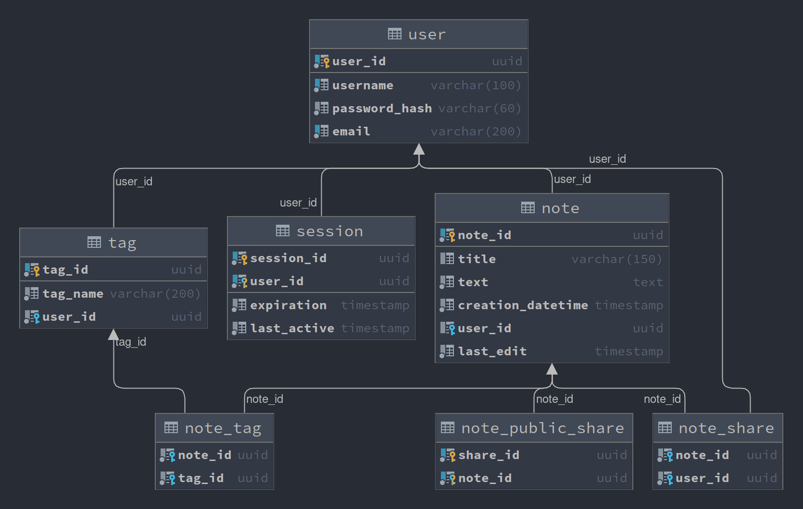

# QuickNotes
### Quick notes is a simple app for writing, displaying, and sharing notes with markdown support.
***This app is not secure enaugh for real use***

### To test this app, use docker-compose and simply start it with 
```bash
docker-compose build && docker-compose up
```
App will be available on http://localhost:8080/
#### On fresh docker start, database will be populated with sample data with two existing accounts:
- login: `email1@domain.com`
    password: `example`
- login: `email2@domain.com`
    password: `example2`

You can also create new account without email verification.

## Database ERD:


---

This app uses a markdown formatting library "marked", available under  
https://github.com/markedjs/marked
